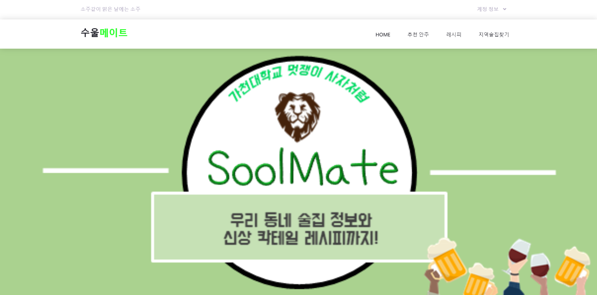

## Soolmate (LIKELION Hackathon Project)
### Preview

### Main Features
- Sign up, Sign in, Sign out
- Snack recommendations
- Cocktail recipes
- Pub information

### Development Environments
- Django + Python + Bootstrap
- Git + Github + Heroku

### Developers
|김지현   |김재목   |윤진호   |이다은   |현암   |
|:-------:|:-------:|:-------:|:-------:|:-------:|
||||||
|[zizi29028](https://github.com/zizi29028)|[JaeMokKim](https://github.com/JaeMokKim)|[Yunjinho](https://github.com/Yunjinho)|[da-nyee](https://github.com/da-nyee)|[HyunAm0225](https://github.com/HyunAm0225)|